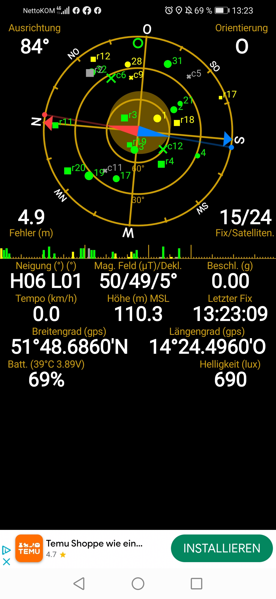

# GPS-Data-Extraction-from-Images

This repository contains a Python script to process images taken from the GPS Status application. The script processes these images, extracts relevant GPS and device data, and then presents this data in a structured tabular format.

Google Colab: https://colab.research.google.com/drive/1qFNz2VfujTHiH01h0GlIjNSker2gybeo?usp=sharing

## Steps of Execution:
### 1. Setup:
Before running the script, you need to ensure you have the necessary libraries and tools installed. The script relies on the pytesseract library for optical character recognition and the PIL library for image processing.

```
pip install pytesseract
sudo apt update
sudo apt install -y tesseract-ocr libtesseract-dev
```

### 2. Image Processing:
For each image provided:

- The image is loaded and cropped to focus on the area containing the relevant data.
- The cropped image is saved in an output directory with the prefix cropped_ added to the original file name.




### 3. Data Extraction:
Using Optical Character Recognition (OCR) provided by pytesseract:

Extracted texts from each image are saved as .txt files in the output directory.
The script searches for the following parameters:
- Date and Time (extracted from the image filename)
- Breitengrad (gps)
- Langengrad (gps)
- Battery Temperature and Voltage
- Battery Percentage

### 4. Tabular Presentation:
- All extracted information is aggregated and presented in a structured tabular format using pandas.
- This table is also exported as a .csv file named results.csv in the output directory for future reference.

## Usage:
- Place your images in the specified directory (default is /content/ for Google Colab).
- Run the script.
- Check the output directory for cropped images, extracted texts, and the final results.csv.

## Note:
This script is optimized for a specific format and layout of the images. If there are any changes in the layout or new updates in the GPS Status application that affect the image format, adjustments to the script may be required.

```
# Install necessary libraries
!pip install pytesseract
!sudo apt update
!sudo apt install -y tesseract-ocr libtesseract-dev

import os
import re
import pandas as pd
from PIL import Image
import pytesseract

# Define the function to extract the desired information
def extract_info_from_text(text):
    details = {
        "Breitengrad (gps)": re.search(r"Breitengrad \(gps\) Langengrad \(gps\)\s*([\d°.'N]+)", text),
        "Langengrad (gps)": re.search(r"Breitengrad \(gps\) Langengrad \(gps\)\s*[\d°.'N]+\s*([\d°.'O]+)", text),
        "Batt. Temp and V": re.search(r"Batt\. \((\d+°C \d+\.\d+V)\)", text),
        "Batt. Percentage": re.search(r"Batt\. \(\d+°C \d+\.\d+V\) Helligkeit \(lux\)\s*(\d+)%", text)
    }
    return {k: v.group(1) if v else "N/A" for k, v in details.items()}

# Extract date and time from the file name
def extract_date_time_from_filename(filename):
    date_pattern = re.compile(r"(\d{4})(\d{2})(\d{2})")
    time_pattern = re.compile(r"(\d{2})(\d{2})(\d{2})")
    
    date_match = date_pattern.search(filename)
    time_match = time_pattern.search(filename)
    
    date = f"{date_match.group(3)}.{date_match.group(2)}.{date_match.group(1)}" if date_match else "N/A"
    time = f"{time_match.group(1)}:{time_match.group(2)}:{time_match.group(3)}" if time_match else "N/A"
    
    return date, time

# Define the cropping box
bbox = (0, 1015, 1440, 1550)

# Specify the image directory
image_directory = '/content/'

# List all the images in the directory
image_files = [f for f in os.listdir(image_directory) if f.startswith('Screenshot_2023') and f.endswith('.jpg')]

# Directory to save cropped images and extracted texts
output_directory = '/content/output/'
os.makedirs(output_directory, exist_ok=True)

results = []

# Process each image
for image_file in image_files:
    # Load and crop the image
    image_path = os.path.join(image_directory, image_file)
    image = Image.open(image_path)
    cropped_image = image.crop(bbox)
    
    # Save the cropped image
    cropped_image.save(os.path.join(output_directory, f"cropped_{image_file}"))
    
    # Extract text using pytesseract
    text = pytesseract.image_to_string(cropped_image)
    
    # Save the extracted text to a .txt file
    with open(os.path.join(output_directory, f"{image_file}.txt"), "w") as txt_file:
        txt_file.write(text)
    
    # Print the extracted text with a separator for clarity
    print("="*80)
    print(f"Extracted text from {image_file}:\n")
    print(text)
    print("="*80)
    
    # Extract the desired information
    extracted_info = extract_info_from_text(text)
    
    # Extract date and time from the file name
    date, time = extract_date_time_from_filename(image_file)
    
    # Store the results
    results.append([date, time] + list(extracted_info.values()))

# Create a DataFrame from the results
df = pd.DataFrame(results, columns=["Date", "Time", "Breitengrad (gps)", "Langengrad (gps)", "Batt. Temp and V", "Batt. Percentage"])

# Save the DataFrame to a .csv file
df.to_csv(os.path.join(output_directory, 'results.csv'), index=False)

# Display the DataFrame
display(df)

```
